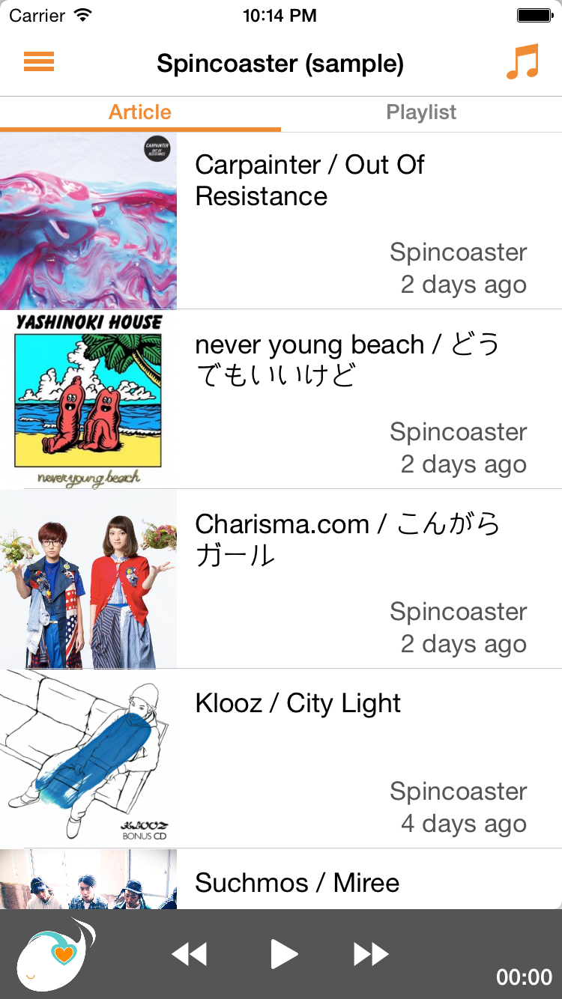
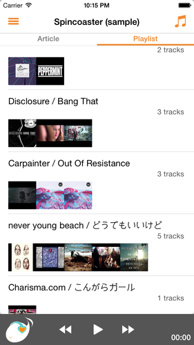
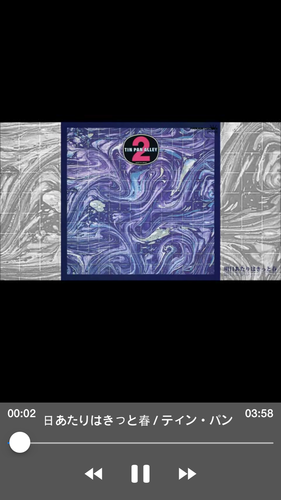

### Follows the music blogs, make your favorite playlists.

* Subscribe RSS feeds via Feedly
* Play video and audio in the article
* Create a playlist from the article
* Play music mini-player and full-screen player
* Support background play and air-play

##### iOS app is comming soon.

<figure class="half">
    
    
    
    
    <figcaption></figcaption>
</figure>
